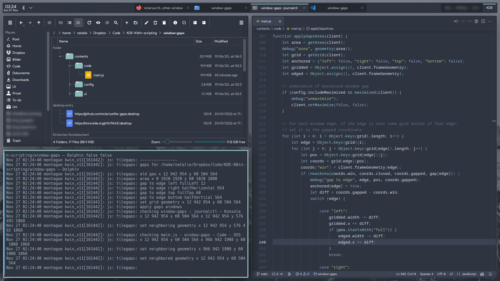

# Interstitia

Interstitia is an extension for KDE's window manager to add space around windows touching a screen edge or other window.

The size of the gap and the layouts and applications to be gapped are configurable.

Please note that this script does not do any automatic tiling. Its purpose is to reshape windows that have been manually positioned with the stock KWin window management system.




## This is a fork!
The original project is [here](https://github.com/nclarius/tile-gaps).
The original project repo appears to be abandoned with no activity since early 2023. This version is maintained at [FredworkLemmas/kwin-tile-gaps](https://github.com/FredworkLemmas/kwin-tile-gaps).

It has been updated for Plasma 6 and is known to work in Plasma 6.5 and Plasma 6.6. It is no longer compatible with Plasma 5.

So far, I've gotten the script to work as intended on Plasma 6.5 and 6.6 and I've addressed a few bugs around border consistency and drag behaviors.

I have new features planned, including cascaded windows in each tile section and new hotkey behaviors.

## Installation

### Dependencies

`kwin` on Plasma 6.

#### Arch Linux
##### packages:
- qt6-tools

##### notes:
- the install script needs `qdbus` to be in the path (for me, append `/usr/lib/qt6/bin/` to `$PATH` in `.bash_profile`)

### Installation via graphical interface

**Please make sure to select the most recent version** in the installation process.

1. Install the script via *System Settings* > *Window Management* > *KWin Scripts* > *Get New Scripts …* > search for *Interstitia* > *Install*.
2. Enable the script by activating its checkbox, and apply the settings.

### Installation via command line

```bash
git clone https://github.com/FredworkLemmas/kwin-tile-gaps.git
cd kwin-tile-gaps
./install.sh
```

## Configuration

*System Settings* > *Window Management* > *KWin Scripts* > *Interstitia* > configuration button.

You may need to uncheck the checkbox for the script, apply the settings, recheck, and reapply in order for the changes to take effect.

### Screen edges

Gap sizes are counted from the area that windows maximize to, i.e. from the edge of any panel you may have on that screen edge, rather than the outer screen edge itself.

### Panels

Gaps on panels are not provided by this extension, but by the Plasma panel: Right-click on panel > *Enter Edit Mode* > *More Settings...* > *Floating Panel*.  

If you have any floating panels, specify this in the configuration so that gaps can be adjusted accordingly.

Latte dock is no longer maintained, and not officially supported by this extension.

### Sticky Window Snapping

For [Sticky Window Snapping](https://store.kde.org/p/1112552/) to work with gaps, make sure you have the threshold in the SWS configuration set to at least the largest gap size.

### Applications

To find the window class name of an application: Right-click on the titlebar of a window of the application > *More Actions* > *Configure Special Application Settings...* > the pre-filled entry in *Window class (application)* (if it consists of two words, only the second part) is the window class to put in the script configuration.


## Small Print

© 2022-2023 Natalie Clarius \<natalie_clarius@yahoo.de\> [nclarius.github.io](https://nclarius.github.io)
© 2026 Fred McDavid \<fred@frameworklabs.us\> [github.com/FredworkLemmas](https://github.com/FredworkLemmas)

This work is licensed under the GNU General Public License v3.0.  
This program comes with absolutely no warranty.  
This is free software, and you are welcome to redistribute and/or modify it under certain conditions.

If you like this project, you can star the [github repo](https://github.com/FredworkLemmas/kwin-tile-gaps) or review the script in the kde store [link TBD].
